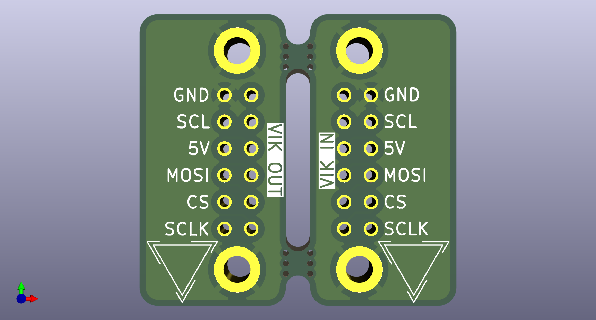
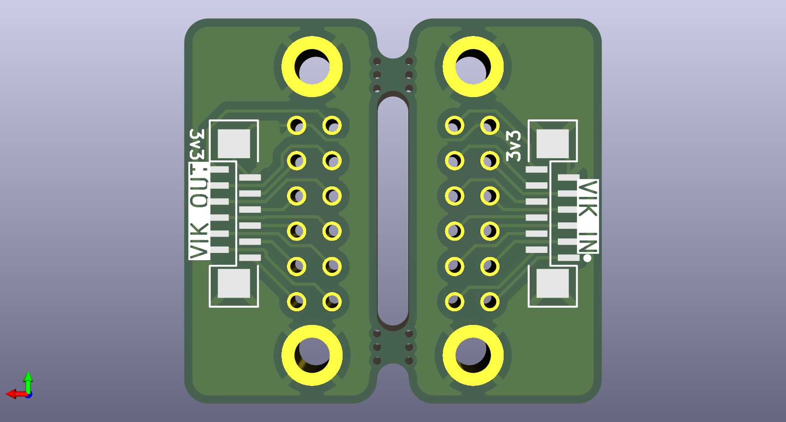

# Magnetic Connectors

## Overview

This is a pair of PCBs that adapt a VIK FPC cable to a 12-pin, 2.2mm pitch
magnetic pogo pin connector and back. The pinout of the magnetic connectors is
equivalent to the standard VIK breakout pin layout.

## Fabrication and BOM

For PCB fabrication, you can use the files in the `production` folder.

* `magnetic-connector.zip` - the file used to fabricate the pcb
* `bom.csv` - used for PCBA. You can also use the part numbers in this file to
  look up the exact parts as [lcsc.com](https://lcsc.com)
* `positions.csv` - used for PCBA

Using the 3 files above, this has been tested at [jlcpcb.com](https://jlcpcb.com)

## VIK module certification

| Category                | Classification          | Response           |
| ----------------------- | ----------------------- | ------------------ |
| FPC connector           | Required                | :heavy_check_mark: |
| Breakout pins           | Recommended             | :heavy_check_mark:*|
| Uses: SPI               | Optional                | :x:                |
| SPI used for SPI only   | Strongly recommended    | :x:                |
| Uses: I2C               | Optional                | :x:                |
| I2C used for I2C only   | Strongly Recommended    | :x:                |
| I2C pull ups            | Required                | :x:                |
| Uses: RGB               | Optional                | :x:                |
| Uses: Extra GPIO 1      | Optional                | :x:                |
| Uses: Extra GPIO 2      | Optional                | :x:                |
| Standard PCB Size/Mount | Strongly recommended    | :x:                |

\* If you count the footprint of the magnetic connector.

## PCB images

### horizontal fpc

