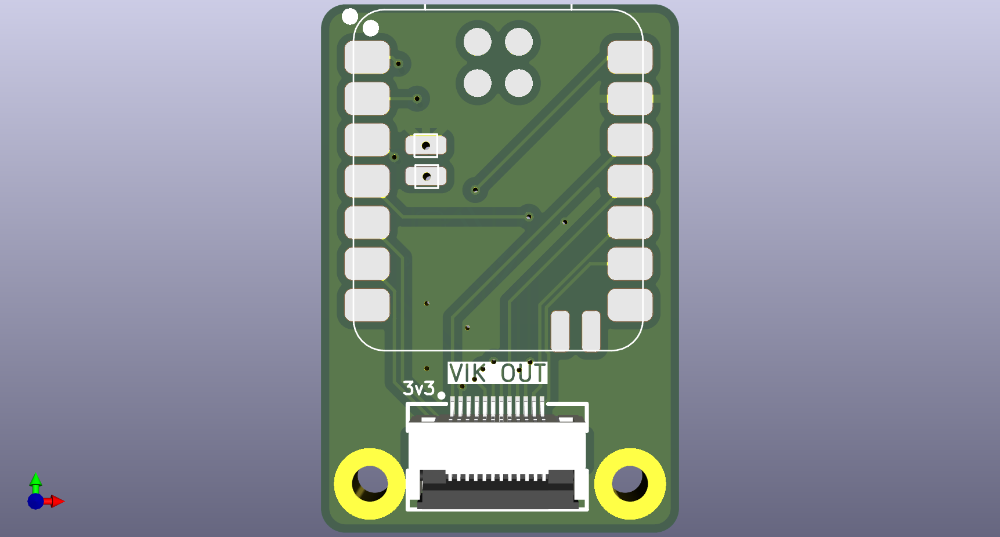
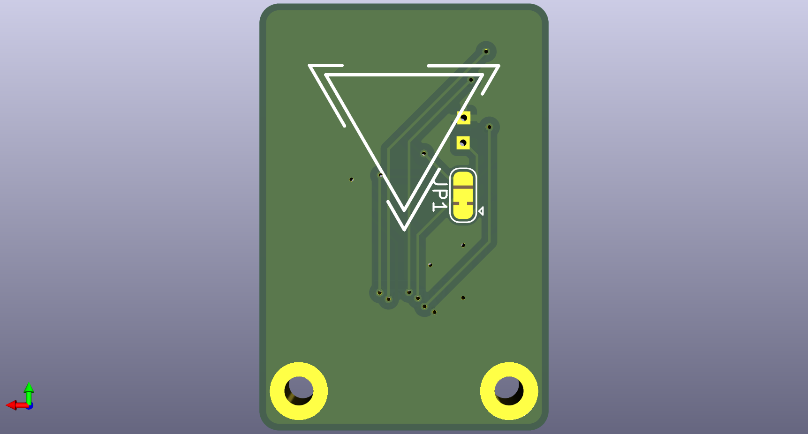

# XIAO VIK Hat

## Overview

This is a simple PCB to add a VIK connector to a Seeed XIAO microcontroller
board. It is mainly intended for the nRF52840 XIAO variant but probably works
for the other variants as well.

The XIAO is surface-mounted to the hat, which allows the BATT+ pad to be
connected as well as making for a lower-profile assembly.

A solder jumper is provided to select which power source is used for the VIK 5V
pin. By default this pin is connected to the BATT+ pad on the XIAO. The
connection can be changed to the USB 5V pin by severing the default jumper and
soldering the other.

## Fabrication and BOM

For PCB fabrication, you can use the files in the `production` folder.

* `xiao-hat.zip` - the file used to fabricate the pcb
* `bom.csv` - used for PCBA. You can also use the part numbers in this file to look up the exact parts as [lcsc.com](https://lcsc.com)
* `positions.csv` - used for PCBA

Using the 3 files above, this has been tested at [jlcpcb.com](https://jlcpcb.com)
These files were generated by the [KiCAD JLCPCB tools plugin](https://github.com/Bouni/kicad-jlcpcb-tools).

## VIK module certification

| Category                | Classification          | Response           |
| ----------------------- | ----------------------- | ------------------ |
| FPC connector           | Required                | :heavy_check_mark: |
| Breakout pins           | Recommended             | :x:                |
| Uses: SPI               | Optional                | :x:                |
| SPI used for SPI only   | Strongly recommended    | :x:                |
| Uses: I2C               | Optional                | :x:                |
| I2C used for I2C only   | Strongly Recommended    | :x:                |
| I2C pull ups            | Required                | :x:                |
| Uses: RGB               | Optional                | :x:                |
| Uses: Extra GPIO 1      | Optional                | :x:                |
| Uses: Extra GPIO 2      | Optional                | :x:                |
| Standard PCB Size/Mount | Strongly recommended    | :x:                |

## PCB images

